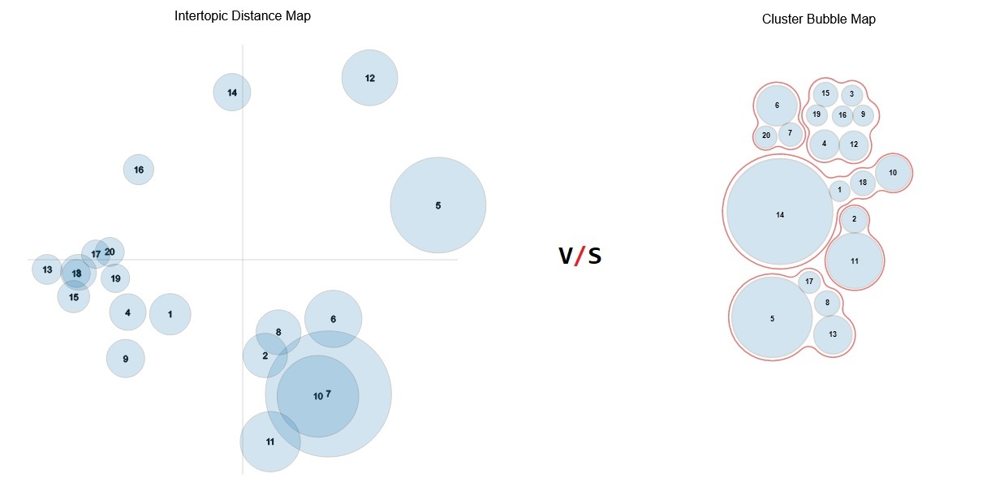

# TOPIC MODEL VISUALISATIONS: A QUALITATIVE USER EVALUATION STUDY

### F21MP - Masters Project and Dissertation - 2023-2024 
#### Heriot-Watt University, Edinburgh, UK

##### *Alex Varbanov - H00456607 - av2049@hw.ac.uk*

_This research project explores the preferences of non-expert users of interactive
topic modelling visualisations by developing a usability testing experiment and
conducting a qualitative evaluation of the user experience. More specifically, we are
interested in two topic modelling visualisation techniques – projection and cluster-
based mapping and their efficacy in conveying the thematic structure of a large
corpus of text documents._

>**This repository serves as the codebase for the technical implementation of the comparative study part of my Masters Project and Dissertation and storage for relevant documentation.** 

|||
|--|--|
| **Project's Aim:** | to evaluate the usability of two topic modelling visualisation strategies |
| **Learning Outcomes:** | to advance understanding by carrying out an investigation which includes prototyping a system. The work consists of presenting a problem (a hypothesis), reviewing existing work, describing the research undertaken (including experimental design), presenting the results of the experiment, presenting the conclusions, relating these to past work and suggesting further work. |
| **Team Size:** | 1 |
| **Project Run:** | 6 months |
| **Grade:** | TBD |
|||

In order to evaluate the usability of a **projection**-**based** topic modelling visualisation against a **cluster**-**based** one, I produced three interfaces for an experiment involving 22 participants.

All interfaces started as [_LDAvis_](https://github.com/bmabey/pyLDAvis) dashboards, as my review of literature showed that this is the most prominent tool used by researchers. I incorporated a [_BubbleTreemap_](https://github.com/grtlr/bubble-treemaps) in place of the projection mapping used by [_LDAvis_](https://github.com/bmabey/pyLDAvis) to produce my second condition. I also produced an interface with no topic-space encoding for training purposes. The topic modelling output used as input for the various dashboards is the same and is derived from fitting an [_LDA_](https://scikit-learn.org/stable/modules/generated/sklearn.decomposition.LatentDirichletAllocation.html) topic model to [_Scikit-learn_'s](https://scikit-learn.org/0.19/datasets/twenty_newsgroups.html) ` 20 Newsgroups dataset `.

* To read the full text of the dissertation, [click here](doc/topic_modelling_vis_comparison_a_varbanov_dissertation.pdf).
* To read the summary of the interface implementation, [click here](code/README.md).
